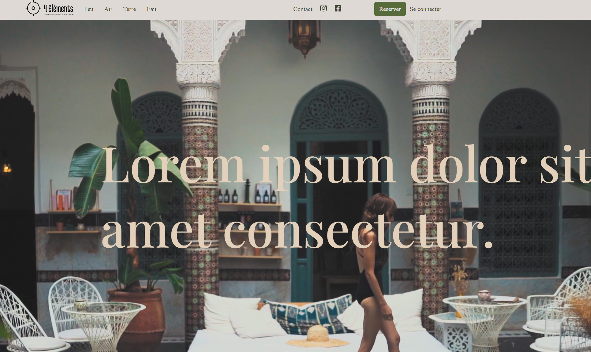
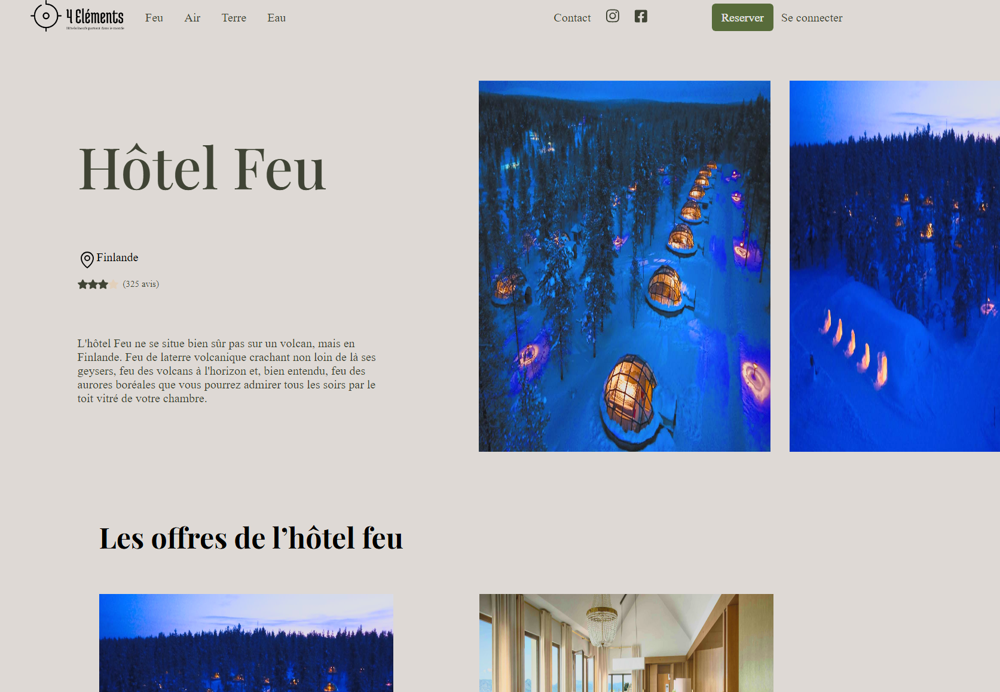
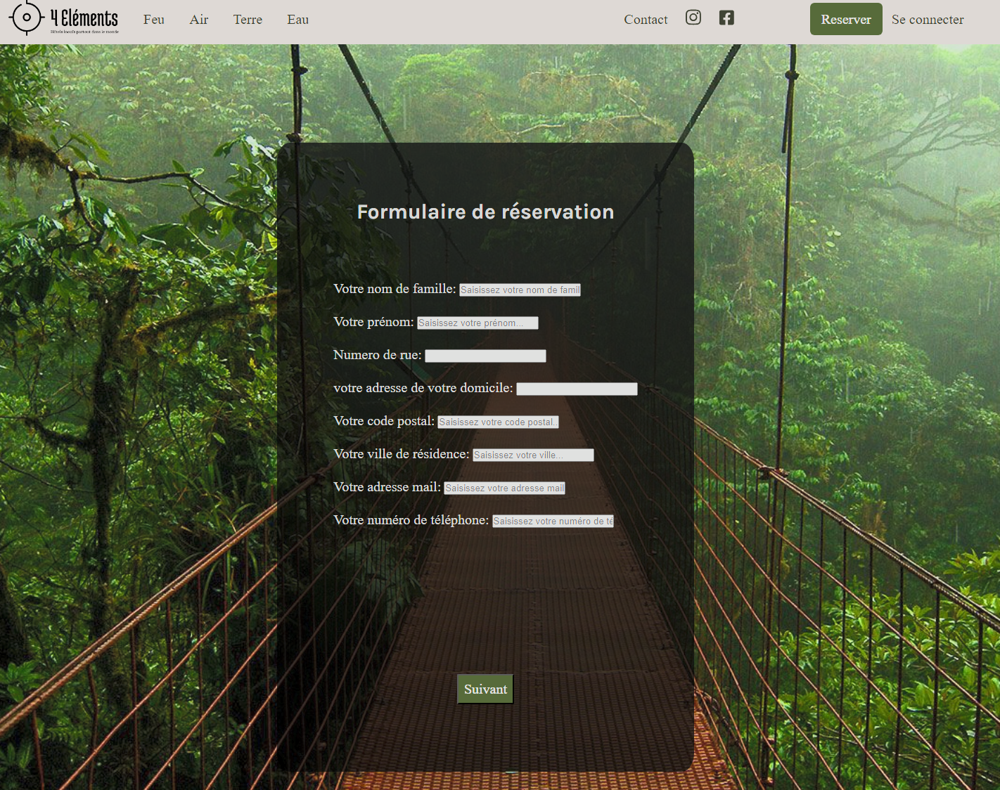

<h1 align="center">🌍 Les 4 éléments - Examen blanc du module Front-End 👋</h1>

<p align="center">
  
  <a href="https://www.figma.com/design/AEZhaJnoPNjfJchgyYD549/4-elements-maquette?node-id=0-1&p=f&t=uJu9DQo4OXT7yuAx-0" target="_blank">
    
  </a>
</p>

---

## 📄 Description du projet | Project Description

🇫🇷 Dans le cadre de l'examen blanc du module **Front-End**, notre formatrice nous a fourni les **maquettes Figma** et le **cahier des charges** pour intégrer un site vitrine.

🎯 **Sujet** : L’entreprise franco-chinoise **"Les 4 éléments"** a construit plusieurs hôtels à travers le monde dans des lieux insolites. Elle a fait appel à des développeurs web pour réaliser leur site.

🛠️ Des **mises à jour seront envoyées progressivement** pour faire évoluer le site au fil du temps.

---

🇬🇧 As part of the mock exam for the **Front-End** module, our instructor provided us with the **Figma mockups** and **specifications** to build a showcase website.

🎯 **Topic**: The Franco-Chinese company **"Les 4 éléments"** has built several hotels around the world in unusual locations. They hired web developers to create their website.

🛠️ **Updates will be delivered progressively** to improve the site over time.

---

## 🖼️ Visuels du site | Website Previews

<p align="center">
  <strong>🏠 Home Page</strong>
</p>
<p align="center">
  
</p>

<p align="center">
  <strong>🔥 Hôtel Feu | Fire Hotel Page</strong>
</p>
<p align="center">
    
</p>

<p align="center">
  <strong>📝 Formulaire | Contact Form</strong>
</p>
<p align="center">
    
</p>

---

## 🧑‍💻 Langages utilisés | Technologies

- **HTML**
- **SCSS**
- **JavaScript**

🇫🇷 JavaScript a été utilisé pour la **gestion du formulaire de réservation**, et SCSS pour le **design global**.  
🇬🇧 JavaScript was used for the **reservation form**, and SCSS for the **overall design**.

---

## 🚀 Démo en ligne | Live Demo

🔗 [Voir la démo sur GitHub Pages](https://devtech-solution.github.io/Les-4-elements/)

---

## 💾 Cloner le projet | Clone the project

### 1. 🇫🇷 Télécharger Git | 🇬🇧 Download Git

🔗 [Télécharger GIT (FR/EN)](https://git-scm.com/downloads)

### 2. 🇫🇷 Cloner le projet | 🇬🇧 Clone the repo

```bash
git clone https://github.com/DevTech-Solution/Les-4-elements.git
```

---

## 👤 Auteur | Author

**Sebastien C.**  
🎓 Promo 2025 (Webecom)  
🔗 GitHub : [@DevTech-Solutions](https://github.com/DevTech-Solution)

---

## 🌟 Support

🇫🇷 Si ce projet vous a été utile, pensez à lui attribuer une **étoile ⭐**.  
🇬🇧 If this project helped you, consider giving it a **⭐**.

---
